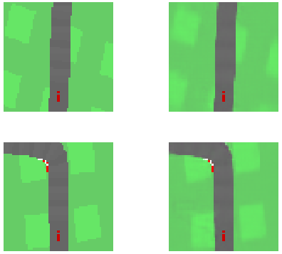
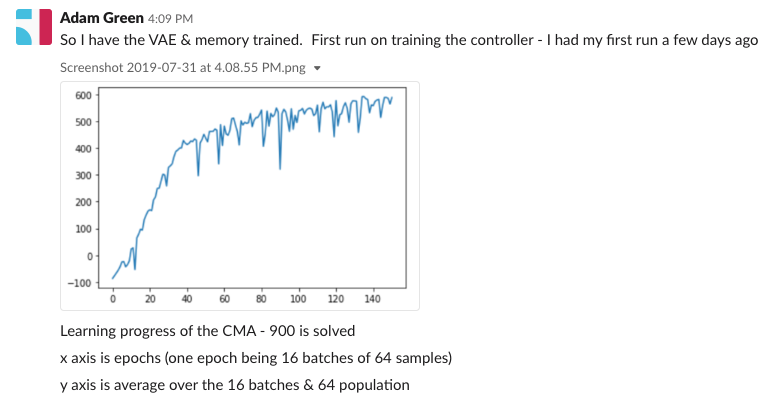

Temporary repo while developing a Tensorflow 2 implementation of *World Models* - David Ha, Jürgen Schmidhuber (2018).

##  Setup

Dependencies for this project are
- tensorflow 2.0
- gym

[Resources in rl-resources/world-models](https://github.com/ADGEfficiency/rl-resources/tree/master/world-models)

Why
- open ai
- love the paper

```bash
git clone https://github.com/ADGEfficiency/world-models
```

# Training from scratch

## Vision 

### Sample data using a random policy

A dataset is generated by from the environment using a random policy - data is placed into `$HOME/world-models-experiments/random-rollouts`.  The original paper uses 10,000 total episodes, with a max episode length of 1,000.  The dataset generation is parallelzied using Python's `multiprocessing`.

To run the dataset generation (tested on Ubuntu 18.04.2 -  c5.4xlarge 512 GB storage):

```bash
bash gym-setup.sh

xvfb-run -a -s "-screen 0 1400x900x24 +extension RANDR" -- python3 worldmodels/dataset/sample_policy.py --num_process 8 --total_episodes 10000 --policy random-rollouts

aws s3 sync ~/world-models-experiments/random-rollouts/ s3://world-models/random-rollouts
```

### Training the Variational Auto-Encoder (VAE)

Reconstructed images on the right:



Original paper uses 1 epoch, the code based supplied uses 10.

The autoencoder saves a copy of the model into `~/world-models-experiments/vae-training/models`.  Run on GPU:

To run the VAE training (tested on Ubuntu 18.04.02 - p2.xlarge 512)

```bash
source tf-setup.sh
before_reboot
source tf-setup.sh
after_reboot

aws s3 sync s3://world-models/random-rollouts ~/world-models-experiments/random-rollouts

python3 worldmodels/vision/train_vae.py --load_model 0 --data local

nvidia-smi -l 1

tail -f ~/world-models-experiments/vae-training/training.csv

aws s3 sync ~/world-models-experiments/vae-training s3://world-models/vae-training
```

### Sampling latent statistics

Sample the statistics (mean & variance) of the VAE so we can generate more samples of the latent variables.  Run on CPU:

```bash
bash tf-cpu-setup.py

aws s3 sync s3://world-models/vae-training/models ~/world-models-experiments/vae-training/models

python3 worldmodels/dataset/sample_latent_stats.py --episode_start 0 --episodes 10000 --data local

aws s3 sync ~/world-models-experiments/latent-stats  s3://world-models/latent-stats
```

## Memory

### Training LSTM Gaussian mixture

Done on GPU - p3.2xlarge

```bash
#  load before & after reboot from tf-setup
source tf-setup.sh

before_reboot

after_reboot

python3 worldmodels/memory/train_memory.py

aws s3 sync ~/world-models-experiments/memory-training  s3://world-models/memory-training
```

## Controller

### Training the CMA-ES linear controller

m5.16xlarge 256

A $200 training of the controller:



But the driving is not so good! 


```bash
aws s3 sync s3://world-models/vae-training/models/ ~/world-models-experiments/vae-training/models
aws s3 sync s3://world-models/memory-training/models/ ~/world-models-experiments/memory-training/models

xvfb-run -a -s "-screen 0 1400x900x24 +extension RANDR" -- python3 worldmodels/control/train_controller.py
tail -f ~/world-models-experiments/control/rewards.log

aws s3 sync ~/world-models-experiments/control/ s3://world-models/control

```

## Iteration Two

Gets confused when on the edge of track
- VAE is the problem

```bash
aws s3 sync s3://world-models/vae-training/models/ ~/world-models-experiments/vae-training/models
aws s3 sync s3://world-models/memory-training/models/ ~/world-models-experiments/memory-training/models
aws s3 sync s3://world-models/control/generations/generation_418 ~/world-models-experiments/control/generations/generation_418

xvfb-run -a -s "-screen 0 1400x900x24 +extension RANDR" -- python3 worldmodels/dataset/sample_policy.py --num_process 8 --total_episodes 10000 --policy controller-rollouts

aws s3 sync ~/world-models-experiments/controller-rollouts/ s3://world-models/controller-rollouts

aws s3 sync s3://world-models/controller-rollouts/ ~/world-models-experiments/controller-rollouts

python3 worldmodels/vision/train_vae.py --load_model 1 --data local --epochs 15

aws s3 sync s3://world-models/controller-rollouts/ ~/world-models-experiments/controller-rlouts

aws s3 sync s3://world-models/results/two/memory-training/models/ ~/world-models-experiments/memory-training/models

had problems with loading old lsmt - insteead train from scratch
python3 worldmodels/memory/train_memory.py --load_model 0
```
